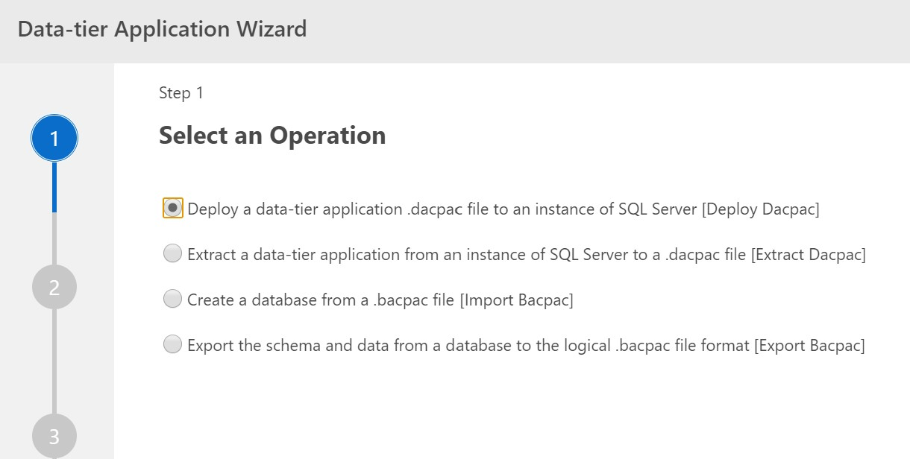
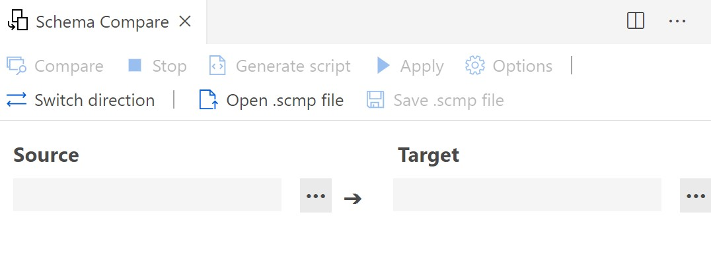

# SQL Ops for Azure Data Studio

Azure Data Studio is a free, open source tool for managing data services like Azure SQL DB or Synapse Analytics on Azure.

## DevOps

* Using Azure DevOps, you would build a Dacpac through the DevOps service.
* Next you deploy via a DevOps Pipeline using Environments.

## Azure Data Studio

### Build a Dacpac

* In Azure Data Studio, you can build a Dacpac based off of an existing database.

### Schema Compare

* You can compare your local SQL files against a Dacpac or an existing database.
* It will then provide you with:
  * A visual display of changes necessary to get the source to match the target.
  * The ability to produce a script of changes.

### Refactor > Rename

* Azure Data Studio does not support an automated rename feature.

