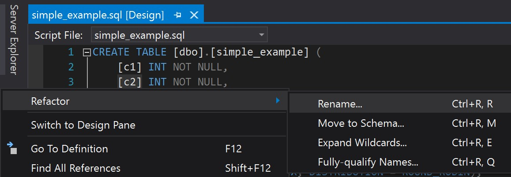
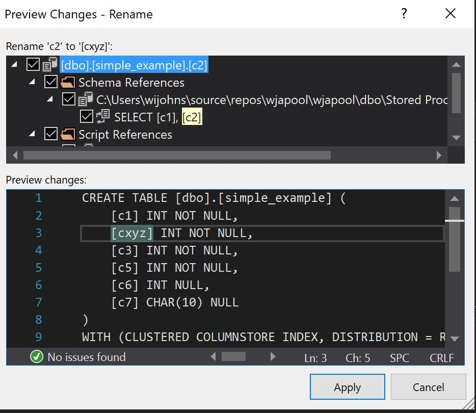
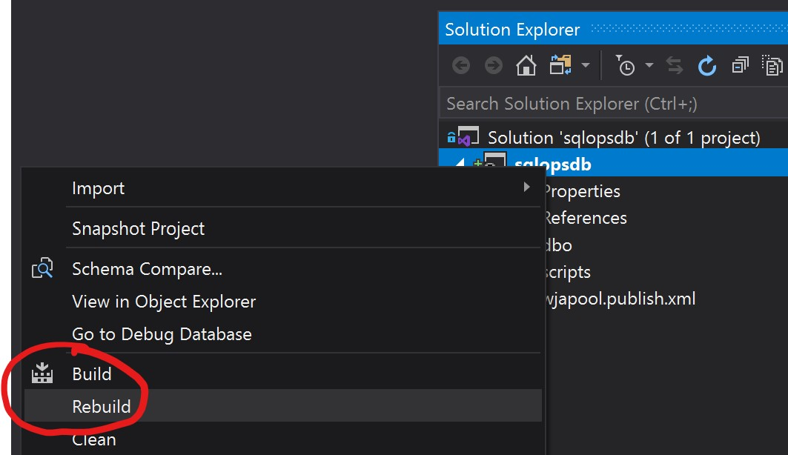

# SQL Ops for Azure SQL DB

SQL Server Data Tools (SSDT) is the best experience for managing Azure SQL Databases and Azure Synapse SQL Pools.

## DevOps

* Using Azure DevOps, you would build a Dacpac through the DevOps service.
* Next you deploy via a DevOps Pipeline using Environments.

## Visual Studio SSDT

### Refactor > Rename

* In SSDT, you are able to refactor by right-clicking on a column name (in the T-SQL editor) and it will create a refactor log and makes changes to all references of the column.
* In addition, it will provide a preview of changes for any other stored procedures or references.

* SSDT does not support this feature when targeting Azure SQL Data Warehouse / Azure Synapse SQL Pools.

### Build a Dacpac

* In SSDT, you can build a Dacpac based off of an existing database or from SQL files.
* From the project, you can right-click and select build or re-build.
  * Re-build seems to be more stable and will attempt to analyze all files.
  * Build will attempt to analyze only recently changed files.
  * Both will generate a dacpac file in `bin/Debug/`.

### Schema Compare

* You can compare your local SQL files against a Dacpac or an existing database.
* It will then provide you with:
  * A visual display of changes necessary to get the source to match the target.
  * The ability to produce a script of changes.
