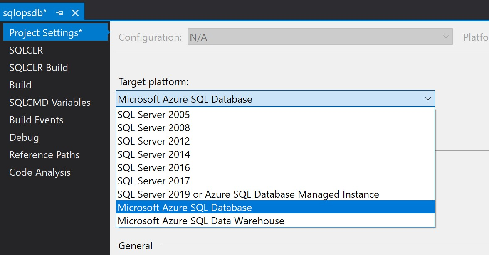

# SQLOps for Azure SQL DB and Synapse SQL Pools

## Generic Workflow
* (SSDT) Create your SQL Database Project targeting a particular database (Azure SQL DB or Azure SQL Data Warehouse)
  * 
  * Azure Data Studio does not have multiple targets but does work with SQL Db and Synapse SQL Pools.
  * You can import a schema from an existing database.
* Connect your Azure DevOps repo to your project.
* Consider following a [release branch git workflow](https://docs.microsoft.com/en-us/azure/devops/repos/git/git-branching-guidance?view=azure-devops#use-release-branches)
  * This has the benefit of creating a stable release before merging into production.
* When you need to release a [hotfix into Production](https://docs.microsoft.com/en-us/azure/devops/learn/devops-at-microsoft/release-flow#releasing-hotfixes)
  * Create a new branch directly from master
  * Make your changes and create a pull request directly to master (rather than your release branch)
  * After completing the production changes, you may [Cherry Pick](https://docs.microsoft.com/en-us/azure/devops/repos/git/cherry-pick?view=azure-devops&tabs=visual-studio) the hotfix changes and merge them into your release branch (via another pull request)

## Feature Comparison

|Feature| SSDT | Azure Data Studio|
|--|--|--|
|Build a Dacpac from SQL Files|Yes|No|
|Build a Dacpac from Existing Db|Yes|Yes (with Extensions)|
|Intellisense / Detect Errors|Yes|Yes (Intellisense) No (Detect Errors)|
|Refactor a column|Yes (SQL DB) No (Synapse)|No|
|Git Integration|Yes|Yes|
|Schema Compare|Yes|Yes (with Extensions)|

## Tool Specific Notes

* [SQL Ops for Data Studio](./docs/SqlOps_DataStudio.md)
* [SQL Ops using Visual Studio SSDT](./docs/SqlOps_SSDT.md)
* [SQL Ops for Synapse SQL Pools](./docs/SqlOps_Synapse.md)

## References

* [General SQLOps Docs](https://www.microsoft.com/en-us/sql-server/developer-get-started/sql-devops/)
* [SQLPackage Docs](https://docs.microsoft.com/en-us/sql/tools/sqlpackage?view=sql-server-ver15)
* [SSDT Pre and Post Deployment Scripts](https://docs.microsoft.com/en-us/sql/ssdt/how-to-specify-predeployment-or-postdeployment-scripts?view=sql-server-ver15)
* [DACPAC Publish Profile](https://github.com/DrJohnT/AzureDevOpsExtensionsForSqlServer/wiki/DAC-Publish-Profile)
